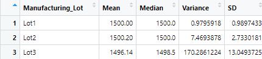
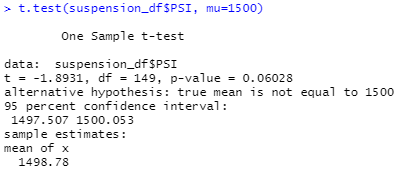
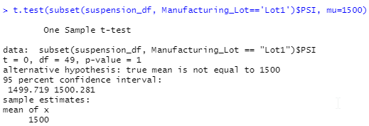
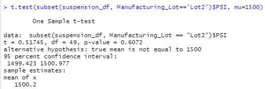
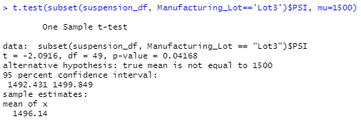

# MechaCar_Statistical_Analysis

## Linear Regress to Predict MPG

Assuming a standard significance level, vehicle length, and ground clearance are unlikely to provide random amounts of variance to mpg values and are therefore likely to have significant impact. Since these variables have a significant relationship with the dependent variable, and othe overall p-value is below standard significance level, the slope is not considered to be zero.

The R-squared value of this model is .7149, which means that while this model is reasonably effective at predicting MPG, it should not be used if a tight error tolerance is required. A different model, whether with additional variables or non-linear, might be able to generate more accurate predictions.

## Summary Statistics on Suspension Coils

If the design specifications for the MechaCar suspension coils dictate that the variance of the suspension coils must not exceed 100 pounds per square inch, then not all suspension coils fulfill these requirements. In the overall population, the standard is met, with a variance of 62.29 PSI.

However, this is not the case when the manufacturing lots are examined individually. While lots 1 and 2 fall within design specifications, lot 3's variance of 170.28 is very far out of spec.

## T-Tests on Suspension Coils

Using T-tests, we can confirm the summary findings: the overall population's p-value is .06028 is close to but greater than the standard significance level of .05. This means we cannot reject the null hypothesis and indicates that the PSI for the overall population does not have statistically signifcant difference from the ideal mean of 1500.

T-testing of the individual lots also confirms the summary findings: lots 1 and 2 have p-values greater than .05, so we fail to reject the null hypothesis. However, lot 3 has a p-value less than .05, so we reject the null hypothesis and find that lot 3's mean PSI differs from the ideal 1500 by a statistically significant amount.

|Lot 1|Lot 2|Lot 3|
|---|---|---|
||||
|Null Hypothesis|Null Hypothesis|Alternative Hypothesis|

## Study Design: Maintenance Costs of MechaCar vs. Competition

A statistical study of maintenance costs would help customers to see whether buying from MechaCar saves them money in the long run. In such a study, the metric would be cumulative maintenance cost over a given period of years. Cumulative maintenance cost data would need to be gathered from MechaCar vehicles as well as competitors.

The null hypothesis in a statistical study of maintenance costs is that there is no statistically significant difference in maintenance between MechaCar and its competitors, while the alternative hypothesis is that such a difference does exist.

Because the independent variable (company) is categorical and the dependent variable (cumulative cost) is numeric, and because this study involves comparison of the distribution of means from multiple samples, an ANOVA test would be used. 