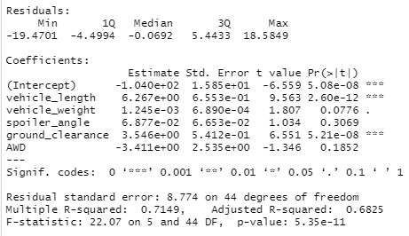

# MechaCar_Statistical_Analysis

## Linear Regress to Predict MPG

Assuming a standard significance level, vehicle length, and ground clearance are unlikely to provide random amounts of variance to mpg values and are therefore likely to have significant impact. Since these variables have a significant relationship with the dependent variable, and othe overall p-value is below standard significance level, the slope is not considered to be zero.

The R-squared value of this model is .7149, which means that while this model is reasonably effective at predicting MPG, it should not be used if a tight error tolerance is required. A different model, whether with additional variables or non-linear, might be able to generate more accurate predictions.

